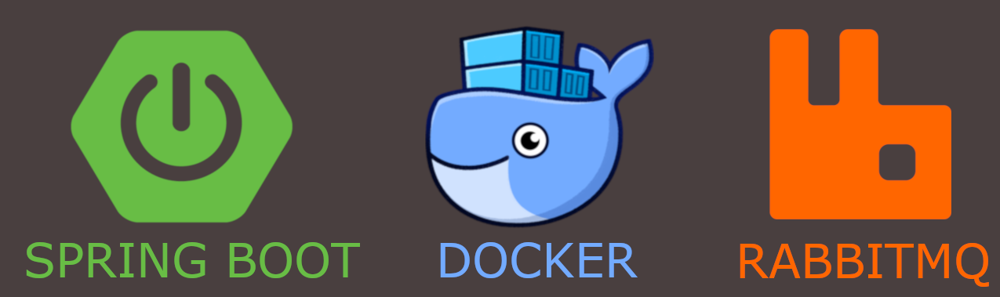
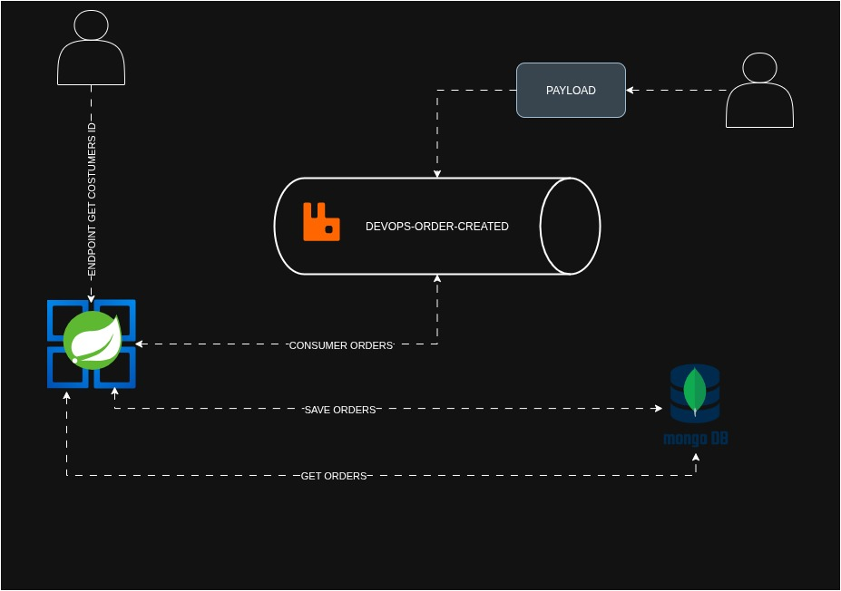

<h1 align="center"> CI/CD - Kubernetes </h1>

  
  

  <a href="#projeto">Projeto</a>&nbsp;&nbsp;&nbsp;|&nbsp;&nbsp;&nbsp;
  <a href="#tecnologias">Tecnologias</a>&nbsp;&nbsp;&nbsp;|&nbsp;&nbsp;&nbsp;
  <a href="#objetivos">Objetivos</a>&nbsp;&nbsp;&nbsp;|&nbsp;&nbsp;&nbsp;
  <a href="#arquitetura">Arquitetura</a>&nbsp;&nbsp;&nbsp;|&nbsp;&nbsp;&nbsp;
  <a href="#roadmap">Roadmap</a>&nbsp;&nbsp;&nbsp;|&nbsp;&nbsp;&nbsp;
  <a href="#referências">Referências</a>

  

## 🌱 Projeto

Escopo do Projeto:

Construir um microserviço que seja capaz de:
- Processar pedidos a partir de uma fila RabbitMQ;
- Criar uma API Rest que permita cosultar:
    - Valor total de um pedido;
    - Quantidade de pedidos por cliente;
    - Lista de pedidos reslizados por cliente;

## ✨ Tecnologias

- [Springboot](https://spring.io/projects/spring-boot)
- [RabbitMQ](https://www.rabbitmq.com/)
- [MongoDB](https://www.mongodb.com/)
- [MongoDB Compass](https://www.mongodb.com/products/tools/compass)
- [Docker](https://www.docker.com/)
- [Insomnia](https://insomnia.rest/download)

## 🎯 Objetivos

Melhorar o entendimento dos itens abaixo:

- Como criar um microserviço com Spring Boot
- Como consumir uma fila do RabbitMQ
- Como comunicar com o banco de dados MongoDB via Docker
- Como mapear uma collection do MongoDB dentro do Spring
- Como fazer aggregations no MongoDB com Spring
- Como efetuar logs com o SLF4J

## ✏️ Arquitetura

- Diagrama arquitetural

  

## 📌 Roadmap

- [x] Entendimento (Qual é o desafio que vamos resolver?)

- Comunicação com o banco de dados:
    - [x] Iniciando o projeto Java (Web, Data MongoDB, RabbitMQ)
    - [x] Configurando o RabbitMQ e MongoDB no Docker
    - [X] Configurando a comunicacao do Spring Boot com o MongoDB
    - [X] Configurando a criacao da fila no RabbitMQ

- Funcionalidade de Consumo de Pedidos:
    - [x] Mapear as entidades (Order, OrderItem)
    - [x] Criar o listener da fila do RabbitMQ
    - [x] Criar a implementação para salvar o pedido no MongoDB
    - [x] Testar o fluxo (rabbitmq → spring → mongodb)

- Funcionalidade de disponibilizar as informações via API:
    - [x] Lembre-se, a API deverá informar:
        - Lista de pedidos realizados por cliente
        - Valor total de um pedido
        - Quantidade de pedidos por cliente
    - [x] Criar endpoint (estruturar DTO de retorno)
    - [x] Criar serviço de listagem de pedidos do cliente
    - [x] Criar serviço que calcula o valor total de todos os pedidos do cliente
    - [x] Testar a API

## 🗒️ Referências

- [Start Springboot](https://docs.spring.io/spring-boot/tutorial/first-application/index.html)
- [Messaging with RabbitMQ](https://spring.io/guides/gs/messaging-rabbitmq)
- [Connecting Spring Boot to MongoDB: A Step-by-Step Guide](https://medium.com/@samuelcatalano/connecting-spring-boot-to-mongodb-a-step-by-step-guide-b9f2fd9e872d)
- [Desafio Backend ~ BTG Pactual  - Build & Run](https://brunograna.notion.site/Desafio-Backend-BTG-Pactual-Build-Run-3f48048e3e594fbea580c006eac6ff08)